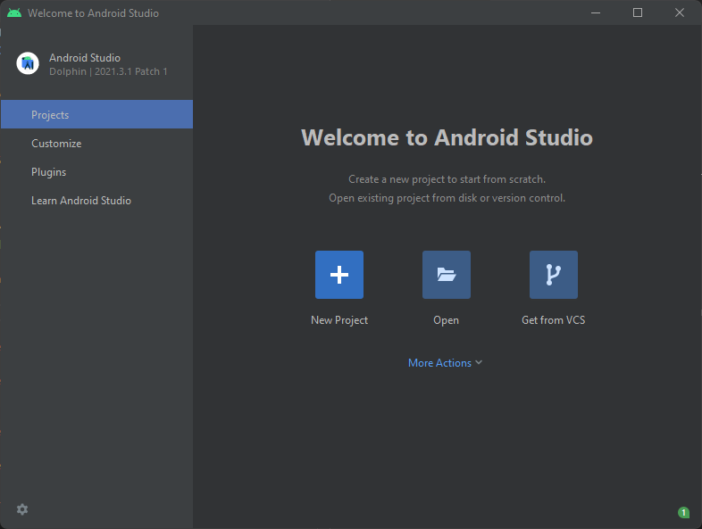
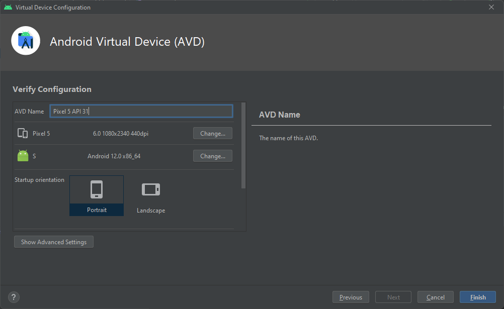
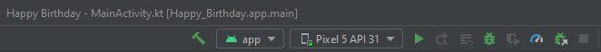
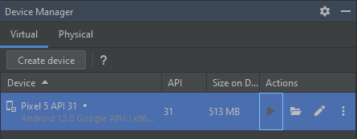

# Laboratorio 10 (Parte 1): Crea y Ejecuta tu Primera App para Android

## Inovación y Emprendimiento con Tecnologías de Información

#### Camilo Andrés Pichimata Cárdenas

##### Noviembre del 2022

## Acerca de este codelab

### Escrito por El equipo de capacitación de Google Developers

##### https://developer.android.com/codelabs/basic-android-kotlin-training-first-template-project#0

## 1. Introducción

En este codelab, crearás tu primera app para Android (Happy Birthday) a partir de una plantilla de apps básica de Android Studio. También explorarás la apariencia de un proyecto de Android y aprenderás a usar diferentes ventanas en Android Studio.

### Requisitos previos

Conocimientos básicos para configurar, ajustar y usar aplicaciones, como un procesador de texto o una hoja de cálculo

### Qué aprenderás

Cómo crear un proyecto de app para Android en Android Studio a partir de una plantilla

### Qué compilarás

Una app básica para Android a partir de una plantilla

### Requisitos

Una computadora con Android Studio instalado

## 2. Crea tu primera app

A continuación, vamos a crear una app a partir de una plantilla de proyecto de **Android Studio**:

- Ejecutamos la aplicación Andorid Studio:

- Damos click en el botón `New Project` y visualizamos la siguiente ventana:

- Dentro de la pestaña `Phone and Tablet` buscamos y seleccionamos la plantilla `Empty Activity` y damos click en el botón `Next`:

- Configuramos el proyecto de la siguiente manera:

- Verificamos que **no** se encuentre seleccionada la opción **_Use legacy android.support libraries_** y damos click en el botón `Finish`:

- Andorid Studio abre el nuevo proyecto, se puede ver que este se está cargando:

- Si damos click en la pestaña `Build` del menu de opciones de la parte inferior vemos el progreso de configuración del proyecto, al finalizarse podemos ver lo siguiente:

## 3. Ejecuta tu app en un dispositivo virtual (emulador)

Ahora se hará uso del administrador de dispositivo virtual de Android (AVD) para crear una versión de software (un emulador) de un dispositivo móvil y ejecutarla en la computadora, esta será usada para ejecutar el app que fue creada a partir de la plantilla utilizada.

Comenzamos creando la configuración para el dispositivo virtual, para esto en la barra de menú de Android Studio seleccionamos `Tools` > `Device Manager`:

Vemos que se abre una sección dentro de Android Studio llamada **Device Manager**, allí damos click en el botón `Create Device`

Se muestra la ventana **_Select Hardware_**, en esta seleccionamos la categoría **_Phone_** y un teléfono, en este caso el **_Pixel 5_** como se puede ver a continación:

Damos click en el botón Next y se muestra la ventana **_System Image_**, allí elegimos la versión del sistema Android que se ejecutará en el nuevo dispositivo virtual, en este caso seleccionaremos `S` como la versión de Android que se ejecutará en el dispositivo virtual:

Como se puede ver se muestra una advertencia al seleccionar esta versión, esto se debe a que no se encuentra descargada la imagen en nuestra computadora, para poder configurar esto debemos darle click en el enlace de descarga que aparece al lado del nombre de la versión, al hacerlo se muestra la siguiente ventana:

Como se puede ver en la imagen, se muestra el progreso de instalacción, esperamos a que temine y damos click en el botón `Finish`:

Al hacer esto deja de aparecer la advertencia y podemos continuar con la configuración:

Damos click en el botón `Next`; Se abre la ventana Android Virtual Device (AVD), donde se pueden seleccionar detalles de configuración adicionales para el nuevo dispositivo:

Especificamos un nombre para el dispositivo si se considera necesario y damos click en el botón `Finish`. El nuevo dispositivo se muestra en la ventana **Android Device** y está listo para usarse:

Para ejecutar el app que fue creada en el dispositivo, en la barra de herramientas, en el menú desplegable seleccionamos el dispositivo creado (**Pixel 5 API 31**):

Luego damos click en el ícono **_Run_** localizado en la ventana Device Manager:

Esperamos a que se inicie el emulador:

Damos Run a la aplicación, y esperamos a que esta se lanze. Finalmente podemos ver en la pantalla del dispositivo virtual la aplicación, en este caso el nombre **"Happy Birthday"** y en el centro de la pantalla el texto **"Hello World"**:

# Laboratorio 10 (Parte 2): Configuración inicial Task Planner App

Para realizar la configuración inicial de nuestra aplicación, comenzamos con la creación de un nuevo proyecto en Android Studio como se mencionó en la parte anterior.

En este caso debido a que ya se encuentra abierto el proyecto creado en la parte anterior podemos dirigirnos a la cinta de opciones de la parte superior, damos click en la opción `File` > `New` > `New Project...` como se visauliza en la siguiente imagen:

Nos aparecerá la ventana de **_New Project_** presentada anteriormente, en este caso, dentro de la pestaña `Phone and Tablet` buscamos y seleccionamos la plantilla `Basic Activity` y damos click en el botón `Next`:

En la siguiente ventana configuraremos nuestro proyecto de la siguiente manera:

Damos click en el botón `Finish` y esperamos a que se complete la configuración del proyecto:

